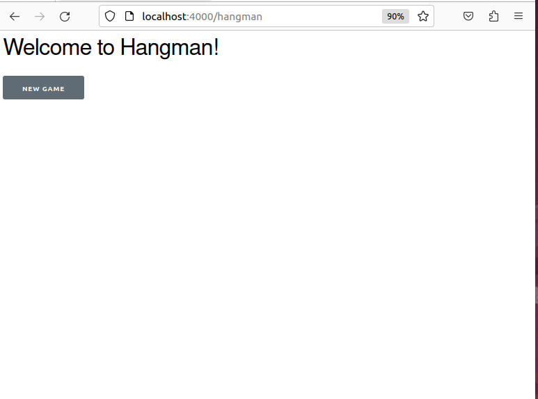
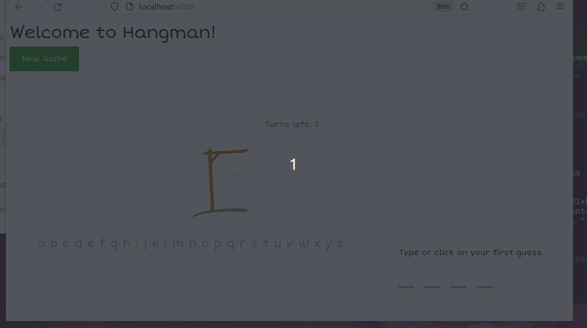

# Elixir4Programmers

Source code for hangman in the course [Elixir for Programmers, Second Edition](https://codestool.coding-gnome.com/courses/elixir-for-programmers-2)

## Example Hangman Html Version

## Example Hangman LiveView Version

